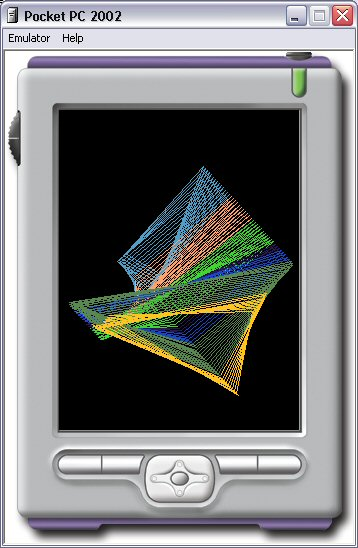



## eVB Line Scramble \(Full Screen\!\)

### Description

This is a improved version of my Line Scramble program. This version supports Full Screen mode by tapping the screen.
 
### More Info
 

             |
---                |---
**Submitted On**   |2004-01-30 17:03:32
**By**             |[Todd Tanner](https://github.com/Planet-Source-Code/PSCIndex/blob/master/ByAuthor/todd-tanner.md)
**Level**          |Intermediate
**User Rating**    |5.0 (10 globes from 2 users)
**Compatibility**  |VB 6\.0
**Category**       |[Windows CE](https://github.com/Planet-Source-Code/PSCIndex/blob/master/ByCategory/windows-ce__1-41.md)
**World**          |[Visual Basic](https://github.com/Planet-Source-Code/PSCIndex/blob/master/ByWorld/visual-basic.md)
**Archive File**   |[eVB\_Line\_S1702021302004\.zip](https://github.com/Planet-Source-Code/todd-tanner-evb-line-scramble-full-screen__1-51377/archive/master.zip)

